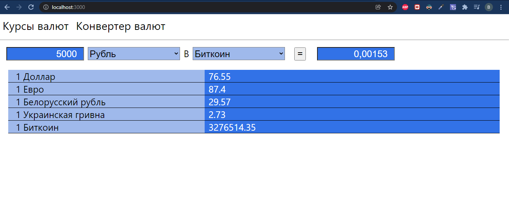

# Сайт с текущими курсами валют и их конвертирования

## Сделано на React
При открытии страницы появляются текущие курсы валют с помощью API-запросов.
##
В верхней части сайта имеется конвертер текущих валют.
При нажатии на кнопку "=" высчитывается ответ. 

